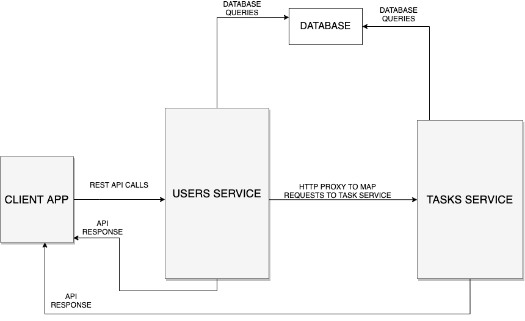

# Project Report

This project was built using a microservice architecture. its folder directory is divided into

- Client : contains the client app built with ReactJS
- Server : contains two services (Tasks and Users) built with NodeJS

## Running this project

I used docker during development, so it should be pretty easy to run this project if you have docker installed on your local machine. If not, you would have to run each service independently. I would take you through each process.

Both processes involve cloning this repositry, so go ahead with that first.

### Running with docker

After cloning this repository,

navigate into the project and run the command below

```bash
docker-compose up
```

On your browser, open up `http://localhost:3000`

Easy yeah ?

### Running each service independently

Hmmmmm....

- Running the client app: Navigate into the client directory and run
  ```bash
  npm install && npm start
  ```
- Running the users service : This service depends on MongoDB, so please ensure you have that installed on you PC. Navigate into the users directory and run

```bash
 npm install && npm start
```

- Running the tasks service : This service depends on MongoDB, so please ensure you have that installed on you PC. Navigate into the tasks directory and run

```bash
npm install && npm start
```

The commands you ran should install the necessary dependencies and run each service.

On your browser, open up `http://localhost:3000`

## Block Diagram

The image below shows the architecture used for this project


## Running Tests

Coming soon....
